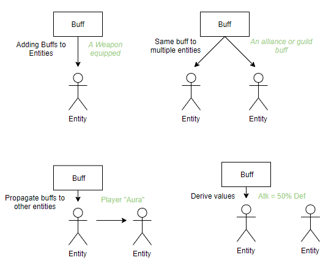

# Buff, Attribute and Stats Calculator Library for Games
  
A event and data-driven, minimalistic, fast, attributes and buffs calculator to be used in video-games, written in Python.  
  
Its objective is to provide an easy to use interface to empower game-designers and developers to create buffs and attributes for their game, covering the most common use cases.  



## Buffs  
  
`Buff` is a word that represents a "Powerup", extra attack for instance. They can be attached to entities, reffered as `buffables`.

When attached to entities, they can modify `attributes` like attack or defence.
  
Buffs have two states, `active` or `inactive`. They can toggle between states based on certain given `conditions` or when  they are waiting for a certain `trigger` to happen.  

## Events

Events are the interaction point with buffs by either toggling conditions on/off, adding a new buff, or firing a trigger.

```python
class PrepareCoffeeEvent(BuffEvent):  
	has_milk: bool = False
	has_ice: bool = False
    
    def __init__(self, buffable: Buffable):  
        super(PrepareCoffeeEvent, self).__init__(buffable)
```

## Attributes

Attributes are created by developers or game-designers, like "attack" and "health". They can be modified by buffs by either having `additive` bonuses, like +5, or `multiplicative` bonuses, like +50%.

```python
additive_attack_buff = BuffBuilder().modify("+", 50, "Attack").build()
multiplicative_attack_buff = BuffBuilder().modify("%", 0.5, "Attack").build()
```
  
## Features  
  
### Data-Driven
  
Attributes, conditions, triggers, buff configurations, are all configured by `specs`, by extending the capabilities of what the library can do.

```python
buff = BuffSpec(buff_id)  
buff.activation_triggers = ["on_prepare_coffee"]  
buff.conditions = ["is_latte"] 
buff.duration_seconds = 10  
buff.modifiers = [Modifier("+", 50, "health")]  
```

### Conditions

Hook functions to be called to check if a given condition is true or not.

```python
@buffspecs.AddConditionFor([PrepareCoffeEvent])  
def is_latte(event: PrepareCoffeEvent):  
   return event.has_milk and !event.has_ice
```

### Triggers  
  
Some buffs might require specific actions to become active, and they might remain active after those actions. 
 ```python
buff = BuffBuilder().modify("+", 50, "Attack").whenever(PrepareCoffeeEvent).only_if("is_latte").build()
add_buff(buffable, buff)

# Buff is inactive 
call_event(PrepareCoffeeEvent(buffable, has_milk=True, has_ice=False))
# Buff is active
 ```

### Expiry Times  
  
Buffs that expire after a set amount of time, without any need of game loop interaction, making it usable in async game servers. The expiry is handled whenever any interaction is done.


### Buff Propagation  

A buff can be added to an entity A, but also affects an entity B if they share a connection.  
A practical example of this is having players and equipments. The player might have a buff that doubles the armor given by his helmet - but not the other armor parts.

Another example is having one single entity propagating buffs to multiple entities, like an alliance castle propagating buffs to all players of that given alliance.

```python
player: Buffable = Player()  
alliance_castle: Buffable = Castle()  
  
castle_buff = BuffBuilder().modify("+", 50, "Attack").propagates_to(Player).build()
add_buff(castle, castle_buff)
```

The propagation map can be registered by the developer.

```
@buffspecs.AddPropagation(Castle, Player)  
def castle_to_player_propagation(player_castle):  
   return player_castle.players
```
  
### Buff Derivation  
  
Derivation is when you transform one attribute into another. An example of this, is the player having a buff that boosts his health by half of his attack power.

```python
# half the attack goes to health
BuffBuilder().modify("%", 0.5, "Attack").to_attribute("Health").build()
```
  
### Buff Stacks  
  
Buffs can stack and be applied multiple times upon a limit, accumulating its power, like a buff that gives +5 attack and stacks 10 times, if triggered 10 times, will sum up 50 attack. This is very often used together with triggers and expiry times.

```python
BuffBuilder().modify("+", 50, "Attack").stacks(3).build()
```

### Combining

You can combine the features to create very interesting effects.

Example, combining `propagation` `stacks` and `expiry` we can have a alliance castle buff, that whenever a player wins a battle, all the alliance gets +50% attack for 10 seconds, up to three times !

```python
BuffBuilder().modify("%", 0.5, "Attack").propagates_to(Player).whenever(BattleWonEvent).stacks(3).for_seconds(10).build()
```

Another example combining propagation and derivation, being able to add a buff that gets the "Attack" of one entity and adding 50% of it to another entity !

```python
BuffBuilder().modify("%", 0.5, Attributes.DEF).propagates_to_attribute(Attributes.DEF) \  
.propagates_to(Player).build()
```

